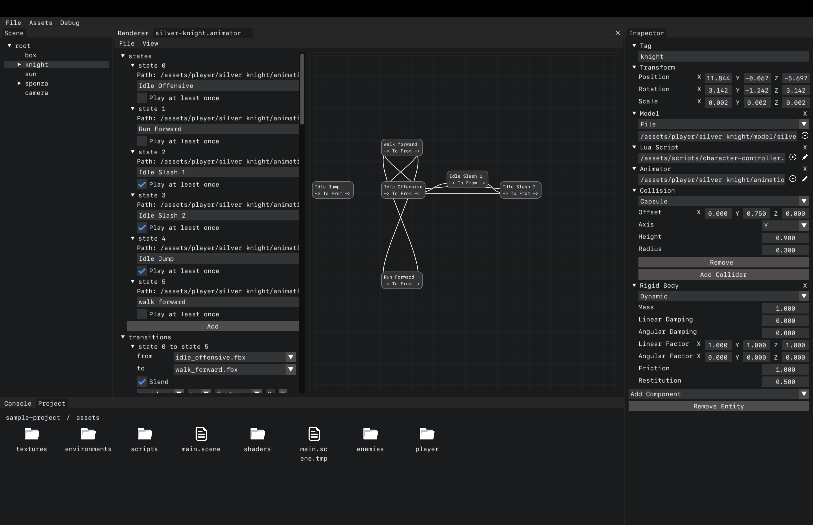

# Dream Engine [WIP]

  

## Author

Deepak Ramalingam

## About

Cross-platform and web compatible real-time 3D engine

Link to web build: [https://rdeepak2002.github.io/dream/](https://rdeepak2002.github.io/dream/)

## Screenshots

